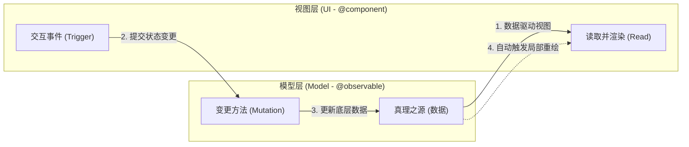

# Flet 声明式编程 (Declarative Programming) 开发规范

Flet 已全面支持声明式编程范式，其核心理念是 **UI = f(state)**。开发者应从“直接操作控件”转向“管理状态，由框架驱动 UI 更新”。

## 1. 核心架构：Model-UI 交互流
根据 Flet 官方范式，应用应划分为**可观察模型 (Model)** 和**声明式组件 (UI)** 两层。其运行逻辑如下：



### 模型层 (Model)
- 使用 `@ft.observable` 装饰。
- **职责**：持有真理之源（数据），并提供显式的变更方法（Mutation Methods）。
- **示例**：`User` 类持有姓名，并提供 `update()` 方法修改姓名。

### 视图层 (UI)
- 使用 `@ft.component` 装饰。
- **职责**：
    1. **读取 (Read)**：订阅模型中的数据并将其映射为 UI 结构。
    2. **触发 (Mutate)**：在交互事件（如 `on_click`）中调用模型层的方法。
- **示例**：`UserView` 读取 `User` 对象并渲染文字；点击“保存”按钮时调用 `user.update()`。

### 自动同步机制
当 UI 触发 Model 的变更方法后，由于 Model 是 `@ft.observable`，Flet 会自动检测到数据变化，并通知所有读取了该数据的 UI 组件进行局部重新渲染。

## 2. 响应式模型 (@ft.observable)
用于定义应用的“真理之源”（持久化数据或领域模型）。
- **必须**使用 `@ft.observable` 和 `@dataclass` 组合。
- **操作规范**：
    - 修改属性（如 `user.name = "Ada"`）或操作列表（如 `app.users.append(user)`）均会触发重绘。
    - 推荐在模型内部定义 `update` 等语义化方法，而不是在 UI 层到处直接修改属性。

```python
@ft.observable
@dataclass
class User:
    first_name: str
    last_name: str

    def update(self, first: str, last: str):
        self.first_name = first
        self.last_name = last
```

## 3. 组件化开发 (@ft.component)
将 UI 拆分为独立的渲染单元。
- **函数式定义**：使用 `@ft.component` 装饰器。
- **纯粹性**：组件应基于传入的参数（Props）和内部状态（Hooks）返回控件。
- **渲染逻辑**：
  ```python
  @ft.component
  def UserRow(user: User, on_delete) -> ft.Control:
      return ft.Row([
          ft.Text(f"{user.first_name}"),
          ft.Button("删除", on_click=lambda _: on_delete(user))
      ])
  ```

## 4. 状态钩子 (Hooks - `ft.use_state`)
用于管理组件内部的、短期的、仅与视图相关的状态。
- **持久性**：确保状态在组件重绘（Re-render）间得以保留。
- **触发重绘**：调用 setter 函数会立即触发该组件及其子树的局部更新。

## 5. 渲染上下文 (Renderer Context) - **Flet 0.80+ 核心要求**
在使用声明式编程（尤其是使用 `@ft.component` 装饰器）时，必须确保应用运行在正确的渲染上下文中。

### A. 启动方式
- **推荐**：使用 **`ft.run(main)`** 替代旧版的 `ft.app(target=main)`。`ft.run` 会自动为整个应用建立声明式渲染的基础。

### B. 渲染方法
- **禁止**：在 `main` 或顶级视图中使用 `page.add(control)`。这会导致 `@ft.component` 报错 `No current renderer is set`。
- **必须**：使用 **`page.render(control)`**。这个方法是声明式编程的入口，它会为所有嵌套的组件注入所需的 Renderer 引用。

```python
def main(page: ft.Page):
    # 正确：使用 render 而不是 add
    page.render(MyRootComponent)

if __name__ == "__main__":
    ft.run(main)
```

## 6. 重构准则 (从命令式转向声明式)

### A. 显隐控制 -> 条件渲染
- **禁止**：`self.control.visible = False; self.page.update()`
- **推荐**：
  ```python
  return ft.Row([...]) if not is_editing else ft.TextField(...)
  ```

### B. 直接修改控件值 -> 修改模型
- **禁止**：`self.text.value = "New Value"`
- **推荐**：`user.update(new_value)`

### C. `page.update()` -> 状态驱动
- 在声明式架构中，**严禁**在业务逻辑中到处调用 `page.update()`。通过更新 `observable` 字段或调用 `use_state` 的 setter 来驱动更新。

## 6. 本项目应用规范
- **大型列表**（如角色库、伤害事件流）：必须使用声明式组件，以利用 Flet 的局部重绘优化。
- **局部 UI 逻辑**：如“点击展开/收起”，使用 `ft.use_state`。
- **全局仿真数据**：使用 `@ft.observable` 定义 `SimulationState`。

---
*来源：Flet 官方文档 - From Imperative to Declarative*
