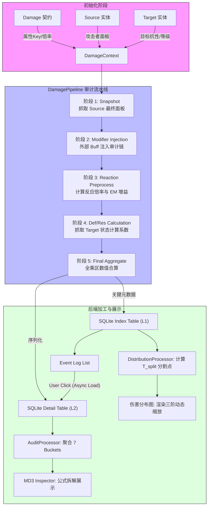

# 伤害审计系统架构 (Damage Audit System Architecture) V2.4

## 1. 概述
伤害审计系统是仿真引擎 V2.4 的核心组件，旨在实现从攻击意图到最终数值结算的全流程“可追溯性”。通过将复杂的伤害公式拆解为 7 个标准审计乘区，系统能够生成详尽的计算日志，并支持工业级的海量数据审计。

## 2. 核心设计理念

### 2.1 计算即审计
系统强制要求所有数值变更必须通过审计接口进行。严禁直接修改实体的 `stats` 字典，确保每一笔伤害的来源、比例和计算过程都有据可查。

### 2.2 二级脱水模型 (Two-Stage Hydration)
为了平衡仿真过程中的高频 I/O 与分析时的海量详情，系统采用分级存储策略：
- **L1 (索引层)**: 存储关键元数据（`event_id`、伤害值、元素、是否暴击、来源标识）。用于 UI 列表的高性能渲染与统计。
- **L2 (详情层)**: 完整序列化存储 `ModifierRecord` 审计链。仅在用户点击特定事件进行“下钻分析”时，才从数据库异步加载并反序列化。

---

## 3. 核心组件实现

### 3.1 DamageContext (审计上下文)
`DamageContext` 是单次伤害计算的“真理之源”，它伴随 `DamagePipeline` 的整个生命周期。
- **审计记录 (`audit_trail`)**: 存储 `ModifierRecord` 列表，记录每个计算步骤。
- **属性快照 (`stats`)**: 实时维护计算过程中的中间变量（如当前总攻击力、当前增伤等）。

```python
# 核心接口示例
ctx.add_modifier(source="武器效果", stat="伤害加成", value=20.0, op="ADD")
```

### 3.2 AuditProcessor (聚合处理器)
负责将离散的 `ModifierRecord` 聚合为符合《原神》伤害公式的 **7 大标准审计乘区**。该处理器是持久化数据与展示层之间的核心桥梁。

| 标识 (Key) | 乘区名称 | 审计内容与计算逻辑 |
| :--- | :--- | :--- |
| **BASE** | **基础属性区** | 攻击力、生命值、防御力、精通等面板最终快照。直接累加面板与 Buff。 |
| **MULT** | **倍率与加值区** | 技能基础倍率 (%) 及固定伤害值加成 (Flat DMG)。执行倍率点积 + 固定值累加。 |
| **BONUS** | **增伤区** | 元素伤害、动作伤害及全伤害加成。公式: `1 + (各百分比之和 / 100)`。 |
| **CRIT** | **暴击区** | 暴击率、暴击伤害快照。公式: `1.0 (非暴击) 或 1 + CD (暴击)`。 |
| **REACT** | **反应区** | 增幅倍率、激化加值、精通提供的反应系数。公式: `基础反应倍率 * (1 + 反应加成)`。 |
| **DEF** | **防御区** | 基于等级比例计算的防御减免系数。公式: `(5*Lvl+500) / (Def+5*Lvl+500)`。 |
| **RES** | **抗性区** | 基于目标抗性及减抗计算的系数。根据抗性区间分段计算。 |

---

## 4. 伤害审计数据流



---

## 5. 后端加工逻辑：伤害分布分析

为了支撑 UI 层的三阶动态缩放引擎，后端 `DistributionProcessor` 负责对仿真全周期的伤害分布进行统计加工：

### 5.1 分割算法实现
系统利用梯度断层算法自动识别伤害值的显著突变点。计算公式如下：
$$T_{split} = \min(v_{after}, \max(v_{before} \times 1.5, Max / 3.0))$$
其中 $v_{before}$ 和 $v_{after}$ 是排序后伤害向量在突变点两侧的平均值。该分割点将数据流切分为“常规区”与“溢出区”，确保 L1 层级展示的复盘曲线具备最佳的可读性。

## 6. 开发与扩展规范

1.  **计算即审计**：严禁直接操作 `stats` 字典，所有数值变更必须通过 `ctx.add_modifier`。
2.  **新增乘区**：如果需要引入新的独立乘区，需同时修改 `DamagePipeline._calculate` 与 `AuditProcessor.BUCKET_MAP` 以保持一致。
3.  **审计来源规范**：`source` 字段建议保持简洁（如“班尼特-美妙旅程”），以便在分析阶段快速识别。
4.  **异步原子化**：审计数据的加工与获取应在独立线程或协程中完成，不得阻塞 UI 主循环。

---
*版本: V2.4.1 (Stable)*
*最近更新: 2026-03-05*
