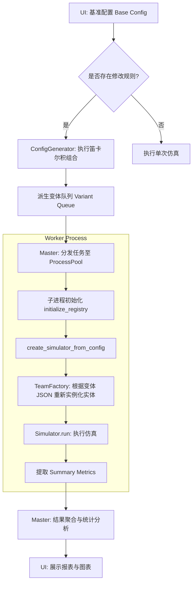

# 架构设计：批量处理系统 (V2.3 - Batch Processing)

## 1. 设计愿景
批量处理（Batch Processing）旨在通过高并发仿真实现统计学验证与参数调优。V2.3 核心引入了 **“基准修改器 (Base Modifier)”** 模式：即通过定义一组“修改规则”，从单一的“基准配置 (Base Config)”中自动派生出大量仿真变体。

---

## 2. 核心概念：基准修改器 (Base Modifier)

不同于手动创建多份配置，用户仅需维护一个基准状态，并叠加一组 **修改规则 (Modification Rules)**。

### 2.1 执行流程图

### 2.2 修改规则的构成
每一条规则包含以下要素：
*   **目标 (Target)**: 采用嵌套路径标识（如 `team[0].weapon.refinement`）。
*   **模式 (Mode)**:
    *   `SWEEP` (区间扫描): 定义 `[start, end, step]` 生成等差数列。
    *   `REPLACE` (固定替换): 提供一个显式的值列表 `[val1, val2, ...]`。
    *   `RANDOM` (随机波动): 定义随机范围，用于蒙特卡洛敏感度分析。
*   **标签 (Label)**: 用于 UI 标识规则名称。

### 2.2 变体生成逻辑
`ConfigGenerator` 接收基准配置和规则集，执行 **笛卡尔积 (Cartesian Product)** 计算。
例如：
- 规则 A (3个值) ❌ 规则 B (4个值) = **12 个仿真样本**。

---

## 3. 系统架构：主从模式 (Master-Worker)

采用基于 `multiprocessing` 的并行计算架构，确保 CPU 密集型任务能够利用多核性能。

### 3.1 Master 节点 (Controller)
*   **职责**: 解析规则集，生成变体队列，管理进程池并聚合轻量级结果。

### 3.2 Worker 节点 (Headless Simulator)
*   **职责**: 独立初始化环境，禁用单帧快照以提速，仅返回 Summary 指标。

---

## 4. 隔离性与持久化设计 (Isolation & Persistence)

### 4.1 进程级别隔离
*   **无共享状态**: 每个 Worker 拥有独立的 Python 进程空间。
*   **独立连接**: `MySQLDataRepository` 在 Worker 内部实例化。

### 4.2 结构化日志持久化
*   **日志文件隔离**: 每个样本对应一个 `run_{index}.log` 文件，存放在任务专属的时间戳子目录中。

---

## 5. UI 交互流 (UX Flow)

1.  **基准确立**: 用户在工作台配置好当前队伍的基准状态。
2.  **规则定义 (Modifier Editor)**: 在批量面板中添加规则。UI 支持点选变量路径并配置扫描参数。
3.  **派生运行**: 点击仿真后，系统自动派生任务队列并展示 `BATCH: 已完成 / 总样本数` 进度。

---
*版本: V2.3 (Base Modifier Pattern)*
*日期: 2026-02-09*