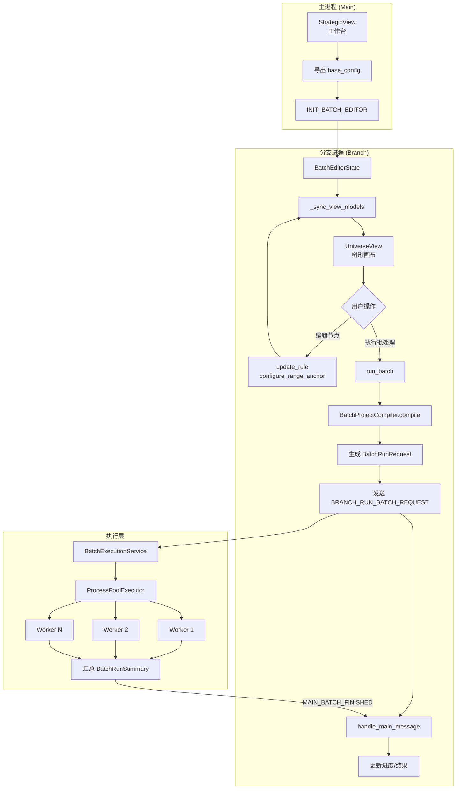
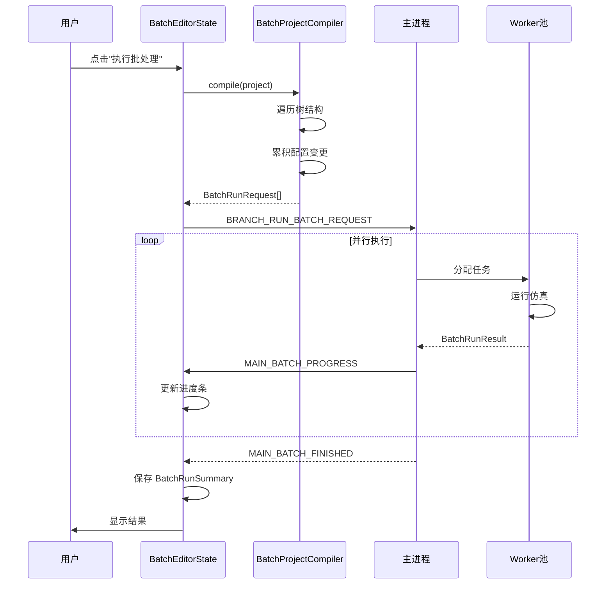
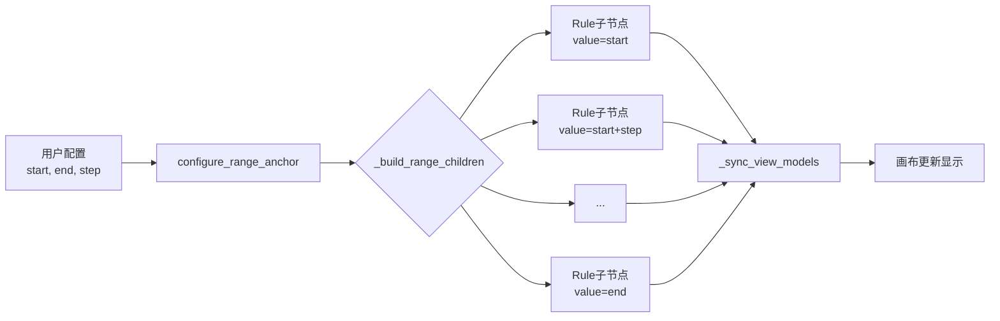

# 架构设计：批量处理系统 (V3.4)

## 1. 设计愿景

批量处理系统采用 **"零状态存储 + 规则派生"** 架构。节点不存储完整配置快照，仅记录变异规则，通过编译器实时生成仿真任务，极大降低内存开销并支持逻辑复用。

---

## 2. 核心数据模型

### 2.1 数据结构层次

```
BatchProject              # 批处理项目根对象
├── version: int          # 版本号
├── name: str             # 项目名称
├── base_config: dict     # 基准配置（从工作台导出）
└── root: BatchNode       # 树根节点

BatchNode                 # 批处理树节点
├── id: str               # 唯一标识
├── name: str             # 显示名称
├── kind: BatchNodeKind   # 节点类型
├── rule: MutationRule    # 变异规则（RULE 类型）
├── range_config: RangeMutationConfig  # 区间配置（RANGE_ANCHOR 类型）
├── children: list[BatchNode]          # 子节点列表
└── generated_from_anchor_id: str      # 来源锚点ID（受控节点标记）
```

### 2.2 节点类型 (`BatchNodeKind`)

| 类型 | 枚举值 | 描述 | 特性 |
|------|--------|------|------|
| **ROOT** | `root` | 根节点 | 代表基准配置，不可删除，不可添加规则 |
| **RULE** | `rule` | 规则节点 | 定义单点参数替换，可自由删除 |
| **RANGE_ANCHOR** | `range_anchor` | 区间锚点 | 自动生成多个 RULE 子节点 |

### 2.3 变异规则 (`MutationRule`)

```python
@dataclass
class MutationRule:
    type: str = "replace"              # 变异类型（当前仅支持 replace）
    target_path: list[str | int]       # 目标路径，如 ["team", 0, "level"]
    value: Any                         # 替换值
    label: str = ""                    # 显示标签
```

### 2.4 区间配置 (`RangeMutationConfig`)

```python
@dataclass
class RangeMutationConfig:
    target_path: list[str | int]       # 目标路径
    start: float                       # 起始值
    end: float                         # 终止值
    step: float                        # 步长
    label: str = ""                    # 显示标签
```

---

## 3. 编译与执行流程

### 3.1 编译器 (`BatchProjectCompiler`)

编译器遍历树结构，累积配置变更，为每个叶子节点生成运行请求：

```python
class BatchProjectCompiler:
    @classmethod
    def compile(cls, project: BatchProject) -> List[BatchRunRequest]:
        requests: List[BatchRunRequest] = []
        base_config = copy.deepcopy(project.base_config)

        def walk(node, config_so_far, snapshot_so_far):
            current_config = copy.deepcopy(config_so_far)

            # 应用 RULE 节点的变异规则
            if node.kind == BatchNodeKind.RULE and node.rule:
                _apply_rule(current_config, node.rule.target_path, node.rule.value)

            # RANGE_ANCHOR 无子节点时跳过
            if node.kind == BatchNodeKind.RANGE_ANCHOR and not node.children:
                return

            # 叶子节点生成运行请求
            if not node.children:
                requests.append(BatchRunRequest(
                    request_id=f"req_{node.id}",
                    node_id=node.id,
                    config=current_config,
                    param_snapshot=current_snapshot,
                ))
                return

            # 递归处理子节点
            for child in node.children:
                walk(child, current_config, current_snapshot)

        walk(project.root, base_config, {})
        return requests
```

### 3.2 路径应用逻辑

`_apply_rule` 方法支持嵌套路径和数组索引：

```python
# 路径示例: ["team", 0, "character", "level"]
# 对应配置: {"team": [{"character": {"level": 90}}]}

current = config
for key in path[:-1]:
    current = current[int(key)] if isinstance(current, list) else current[key]
current[path[-1]] = value
```

---

## 4. IPC 通信协议

批量处理采用独立进程架构，通过队列实现主进程与分支进程通信。

### 4.1 消息类型

| 常量 | 方向 | 含义 |
|------|------|------|
| `BRANCH_RUN_BATCH_REQUEST` | Branch → Main | 提交批处理执行请求 |
| `MAIN_BATCH_PROGRESS` | Main → Branch | 执行进度更新 |
| `MAIN_BATCH_FINISHED` | Main → Branch | 执行完成 |
| `MAIN_BATCH_REJECTED` | Main → Branch | 执行被拒绝 |

### 4.2 请求消息格式

```python
# BRANCH_RUN_BATCH_REQUEST
{
    "type": "BRANCH_RUN_BATCH_REQUEST",
    "run_id": "abc123...",
    "project_name": "芙宁娜DPS测试",
    "requests": [BatchRunRequest.to_dict(), ...]
}
```

### 4.3 响应消息格式

```python
# MAIN_BATCH_PROGRESS
{
    "type": "MAIN_BATCH_PROGRESS",
    "run_id": "abc123...",
    "done": 5,
    "total": 20,
    "status_text": "批处理执行中 5/20"
}

# MAIN_BATCH_FINISHED
{
    "type": "MAIN_BATCH_FINISHED",
    "run_id": "abc123...",
    "summary": BatchRunSummary.to_dict()
}

# MAIN_BATCH_REJECTED
{
    "type": "MAIN_BATCH_REJECTED",
    "run_id": "abc123...",
    "reason": "already_running",
    "message": "已有批处理任务在执行中"
}
```

---

## 5. 执行结果模型

### 5.1 单次运行结果 (`BatchRunResult`)

```python
@dataclass
class BatchRunResult:
    request_id: str
    node_id: str
    node_name: str
    total_damage: float = 0.0
    dps: float = 0.0
    simulation_duration: int = 0
    param_snapshot: dict = field(default_factory=dict)
    error: str | None = None
```

### 5.2 批量执行摘要 (`BatchRunSummary`)

```python
@dataclass
class BatchRunSummary:
    total_runs: int = 0
    completed_runs: int = 0
    failed_runs: int = 0
    avg_dps: float = 0.0
    max_dps: float = 0.0
    min_dps: float = 0.0
    std_dev_dps: float = 0.0
    p95_dps: float = 0.0
    results: list[BatchRunResult] = field(default_factory=list)
    errors: list[str] = field(default_factory=list)
```

---

## 6. 持久化存储

### 6.1 存储服务 (`BatchProjectStorage`)

```python
class BatchProjectStorage:
    def save(self, project, filename) -> str          # 保存到默认目录
    def load(self, filename) -> BatchProject          # 从默认目录加载
    def save_to_path(self, project, path) -> str      # 保存到任意路径
    def load_from_path(self, path) -> BatchProject    # 从任意路径加载
```

### 6.2 环境解耦设计

- **不保存 `base_config`**：批处理方案与具体角色/队伍配置解耦
- **仅序列化树结构与规则**：允许将一套方案加载到不同工作台配置
- **逻辑复用**：支持跨角色、跨队伍的测试逻辑迁移

---

## 7. 流程图

### 7.1 整体架构流程


```mermaid
flowchart TB
    subgraph Main["主进程 (Main)"]
        A[StrategicView<br/>工作台] --> B[导出 base_config]
        B --> C[INIT_BATCH_EDITOR]
    end

    subgraph Branch["分支进程 (Branch)"]
        D[BatchEditorState] --> E[_sync_view_models]
        E --> F[UniverseView<br/>树形画布]
        F --> G{用户操作}
        G -->|编辑节点| H[update_rule<br/>configure_range_anchor]
        G -->|执行批处理| I[run_batch]
        H --> E
        I --> J[BatchProjectCompiler.compile]
        J --> K[生成 BatchRunRequest]
        K --> L[发送 BRANCH_RUN_BATCH_REQUEST]
        L --> M[handle_main_message]
        M --> N[更新进度/结果]
    end

    C --> D

    subgraph Execution["执行层"]
        O[BatchExecutionService] --> P[ProcessPoolExecutor]
        P --> Q1[Worker 1]
        P --> Q2[Worker 2]
        P --> Q3[Worker N]
        Q1 --> R[汇总 BatchRunSummary]
        Q2 --> R
        Q3 --> R
    end

    L --> O
    R -->|MAIN_BATCH_FINISHED| M
```

### 7.2 编译执行流程


```mermaid
sequenceDiagram
    participant U as 用户
    participant B as BatchEditorState
    participant C as BatchProjectCompiler
    participant M as 主进程
    participant W as Worker池

    U->>B: 点击"执行批处理"
    B->>C: compile(project)
    C->>C: 遍历树结构
    C->>C: 累积配置变更
    C-->>B: BatchRunRequest[]
    B->>M: BRANCH_RUN_BATCH_REQUEST

    loop 并行执行
        M->>W: 分配任务
        W->>W: 运行仿真
        W-->>M: BatchRunResult
        M->>B: MAIN_BATCH_PROGRESS
        B->>B: 更新进度条
    end

    M-->>B: MAIN_BATCH_FINISHED
    B->>B: 保存 BatchRunSummary
    B->>U: 显示结果
```

### 7.3 区间锚点展开流程


```mermaid
flowchart LR
    A[用户配置<br/>start, end, step] --> B[configure_range_anchor]
    B --> C{_build_range_children}
    C --> D1[Rule子节点<br/>value=start]
    C --> D2[Rule子节点<br/>value=start+step]
    C --> D3[...]
    C --> D4[Rule子节点<br/>value=end]
    D1 --> E[_sync_view_models]
    D2 --> E
    D3 --> E
    D4 --> E
    E --> F[画布更新显示]
```

---

## 8. 设计模式总结

| 模式 | 应用场景 |
|------|---------|
| **组合模式** | `BatchNode` 通过 `children` 形成树形结构 |
| **策略模式** | 不同 `BatchNodeKind` 有不同的编译和渲染策略 |
| **模板方法** | `BatchProjectCompiler.compile()` 定义遍历骨架 |
| **观察者模式** | `@ft.observable` 实现响应式更新 |
| **MVVM** | `BatchEditorState` (VM) → `UniverseView` (V) → `BatchProject` (M) |

---

*版本: V3.4*
*日期: 2026-03-22*
