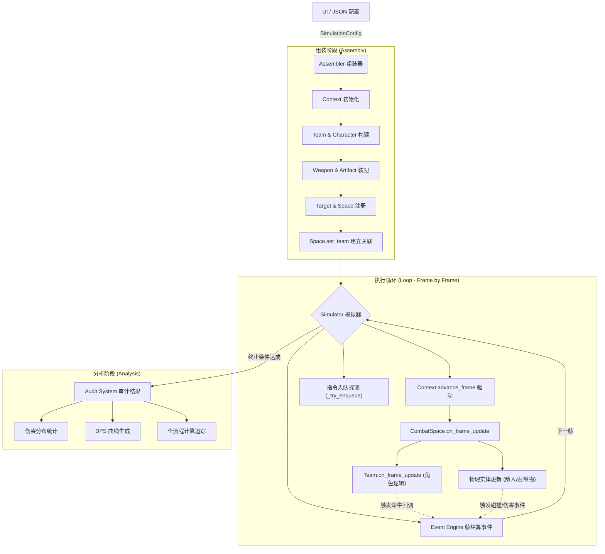

# 仿真运行流程 (Simulation Workflow)

本文档描述了“原神伤害计算器”仿真引擎从配置输入到结果产出的全生命周期流程。

## 1. 流程概览

仿真过程分为四个核心阶段：**配置解析**、**环境组装**、**帧级驱动** 以及 **审计分析**。

---

## 2. 阶段详解

### 阶段一：配置解析 (Configuration)
UI 层导出标准化的 JSON 数据。动作标识符（Action ID）已与后端 Key 统一（如 `elemental_skill`, `normal_attack`），不再需要转换映射。

### 阶段二：环境组装 (Assembly)
由 `SimulationAssembler` 驱动：
1.  **创建 Context**：实例化 `SimulationContext`。
2.  **构建队伍**：`TeamFactory` 创建角色，并将 `Team` 实例注入到 `CombatSpace` 中。
3.  **动态同步**：`CombatSpace` 通过 `set_team` 自动感知场上角色，不再手动注册玩家实体。
4.  **注入坐标**：将目标（Enemy）根据配置注册到 `CombatSpace`。

### 阶段三：帧级驱动 (Execution)
模拟器以 60FPS 的步长推进，采用 **“单一入口，级联驱动”** 模式：
1.  **脉冲触发**：`Simulator` 调用 `Context.advance_frame()`。
2.  **物理与逻辑链**：
    *   `Context` 驱动 `CombatSpace.on_frame_update()`。
    *   `CombatSpace` 先驱动 `Team.on_frame_update()`，确保**所有角色**（场上+后台）的 ASM、CD、充能得到更新。
    *   `CombatSpace` 随后驱动内部存储的**物理实体**（敌人、召唤物等）。
3.  **指令下发**：模拟器检测 `Team.current_character` 的状态，若空闲则从队列提取下一个指令并执行 `perform_action`。
4.  **子系统响应**：通过事件引擎处理伤害（DamageSystem）、反应（ReactionSystem）及数值审计。

### 阶段四：分析阶段 (Analysis)
当指令队列清空且 `Team` 中所有成员的 ASM 均处于 IDLE 状态时，仿真终止。

---

## 3. 核心设计原则

*   **场景中心化 (Scene-Centric)**：`CombatSpace` 是战斗世界的主管，包含了物理实体与逻辑队伍。
*   **驱动内聚**：角色本体逻辑驱动完全收敛于 `Team`，物理感知由 `Space` 动态合并。
*   **计算即审计 (Audit on Compute)**：每一帧产生的数值变动必须携带来源声明。
*   **物理同步 (Physics Sync)**：下落攻击等高度敏感动作由物理高度（Y轴）实时驱动，而非固定帧数。

---
*版本: V2.4.1 (Scene-Centric & Cascade Driver)*
*更新日期: 2026-02-14*

