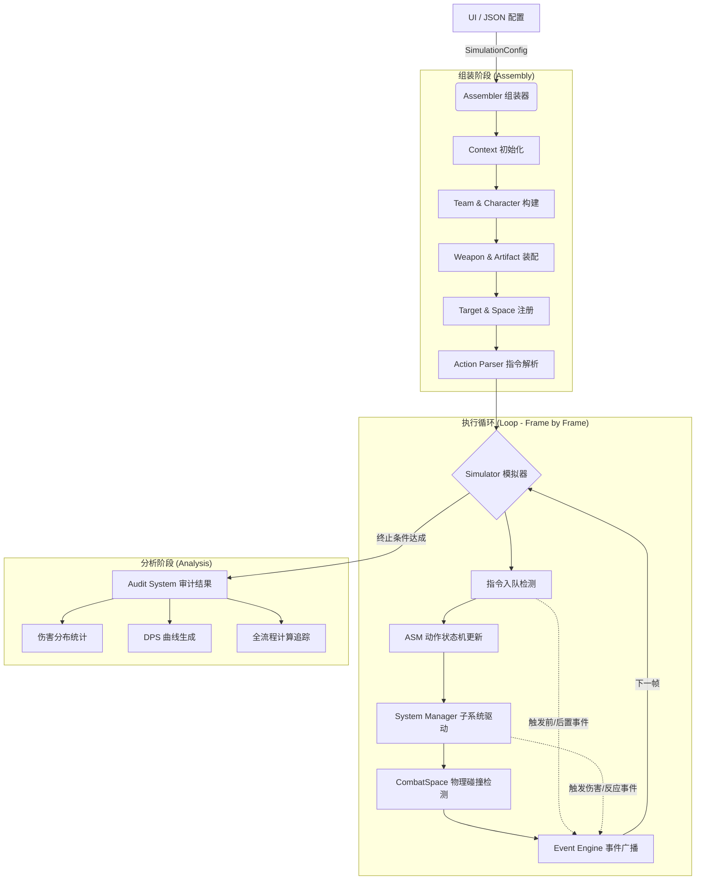

# 仿真运行流程 (Simulation Workflow)

本文档描述了“原神伤害计算器”仿真引擎从配置输入到结果产出的全生命周期流程。

## 1. 流程概览

仿真过程分为四个核心阶段：**配置解析**、**环境组装**、**帧级驱动** 以及 **审计分析**。

---

## 2. 阶段详解

### 阶段一：配置解析 (Configuration)
UI 层导出包含 `context_config` (队伍/环境) 和 `sequence_config` (指令序列) 的 JSON 数据。此阶段不涉及任何对象实例化，仅作为数据载体。

### 阶段二：环境组装 (Assembly)
由 `SimulationAssembler` 驱动：
1.  **创建 Context**：实例化 `SimulationContext`，挂载全局事件引擎和子系统。
2.  **构建队伍**：`TeamFactory` 根据 ID 实例化角色，同步数据库基础属性。
3.  **动态装配**：将武器技能、圣遗物套装效果以 `Effect` 形式挂载至实体。
4.  **注入坐标**：将角色与目标根据配置注册到 `CombatSpace` 的特定 X, Z 坐标。

### 阶段三：帧级驱动 (Execution)
模拟器以 60FPS (16.67ms/帧) 的步长推进：
1.  **指令下发**：模拟器检测当前是否有角色处于 `IDLE` 状态，若有则从队列提取下一个 `ActionCommand` 传给 `ActionManager`。
2.  **动作机更新 (ASM)**：`ActionInstance` 推进当前帧数，平摊位移，并根据 `hit_frames` 触发命中回调。
3.  **子系统响应**：
    *   **DamageSystem**：处理伤害流水线 (Snapshot -> Critical -> Reaction -> Audit)。
    *   **ReactionSystem**：处理元素反应的副作用 (生成实体、扩散、减抗)。
    *   **Health/EnergySystem**：维护血量与能量的动态平衡。
4.  **物理空间更新**：`CombatSpace` 更新所有实体的位置，处理位移广播。

### 阶段四：分析阶段 (Analysis)
当指令队列清空且所有动作结束时，仿真终止：
*   汇总 `ctx.total_damage`。
*   通过 `DamageAuditSystem` 回溯每一笔伤害的审计链 (Audit Trail)，展示加成来源。
*   导出全帧快照用于可视化回放。

---

## 3. 核心设计原则

*   **数据驱动 (Data-Driven)**：仿真逻辑与原生数据解耦，通过组装器完成映射。
*   **计算即审计 (Audit on Compute)**：每一帧产生的数值变动必须携带来源声明。
*   **物理同步 (Physics Sync)**：逻辑层动作与物理层位置在同一帧内完成同步，确保护盾、扩散等空间机制的准确性。
