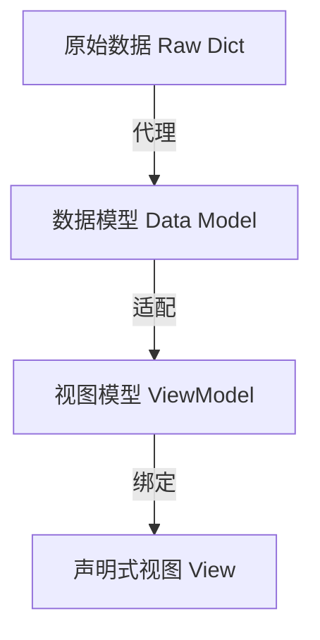

# UI 架构概览 (MVVM V5.0+)

> 本文档描述了原神伤害计算器项目基于 Flet V3 的 **MVVM (Model-View-ViewModel)** 声明式架构准则。

---

## 1. 核心架构：四层解耦模型

项目采用四层数据流向架构，旨在彻底分离“底层仿真数据格式”与“前端 UI 交互逻辑”。

### 1.1 原始数据层 (Raw Data)
- **定位**: 纯字典 (`dict`) 或 JSON。
- **职责**: 负责持久化、序列化以及与仿真引擎的原始兼容。
- **规范**: 严禁在 View 层直接读写此层数据。

### 1.2 数据模型层 (Data Model)
- **位置**: `core/data_models/`
- **定位**: 强类型代理类 (Proxy Wrapper)。
- **职责**: 包装 Raw Dict，提供强类型 Getter/Setter，处理存储格式转换（如 `str <-> int`）及业务逻辑校验。
- **特性**: 不依赖 Flet，纯 Python 逻辑。

### 1.3 视图模型层 (ViewModel)
- **位置**: `ui/view_models/`
- **定位**: 响应式状态模型 (`@ft.observable`)。
- **职责**: 持有 Model 引用，负责 UI 格式化（如显示标签、图标路径）并显式调用 `self.notify()` 驱动重绘。
- **特性**: 使用 **组合模式** (Composition) 管理子系统（如 `CharacterVM` 持有 `WeaponVM`）。

### 1.4 表现层 (View)
- **位置**: `ui/views/` & `ui/components/`
- **定位**: 声明式函数组件 (`@ft.component`)。
- **职责**: 仅负责 UI 声明与绑定。只允许访问 VM 属性，调用 VM 方法。
- **规范**: 遵循 `UI = f(ViewModel)` 范式。

---

## 2. 性能优化：稳定控件树 (Stable Control Tree)

为了解决复杂面板（如战略工作台）切换角色时的卡顿问题，强制执行 **Active Proxy** 模式。

### 2.1 Active Proxy 模式
- **原理**: 复杂的详情区域绑定到一个唯一的、常驻的代理 VM (`ActiveCharacterProxy`)。
- **交互**: 切换角色时不销毁 UI 控件，仅调用 `proxy.bind_to(new_character_vm)` 更新内部数据引用。
- **效果**: Flet 仅执行“手术级”的属性更新（`value` 变更），避免了大规模的 DOM 销毁与重建。

---

## 3. 全局状态与服务集成

### 3.1 AppState 瘦身
- `AppState` 不再直接操作底层字典 Key。
- **服务化**: 逻辑抽离至 `MetadataService` (元数据) 和 `SimulationService` (仿真调度)。
- **生命周期协调**: `AppState` 负责在配置全局重载时，协调各子 State 重建其 ViewModel 树。

### 3.2 刷新机制
- 废弃旧版 `refresh_count` 强制刷新方案及 `UIEventBus`。
- **标准做法**: 
    1. 修改 VM 属性。
    2. VM 内部调用 `self.notify()`。
    3. 组件通过直接绑定 VM 实例实现自动重绘。

---

## 4. 技术栈规范

*   **启动入口**: 必须使用 `ft.run(main)`。
*   **渲染根节点**: 必须使用 `page.render(lambda: RootComponent(vm))`。
*   **颜色常量**: 统一使用下划线格式 `ft.Colors.BLACK_26`。
*   **组件通信**: 完全基于 ViewModel 属性绑定。

---
*更新日期: 2026-03-07 (V5.0 重大重构)*
