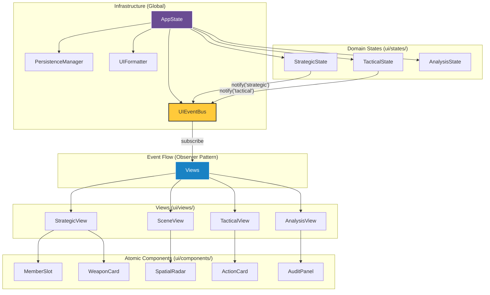

# UI 重构架构说明 (Strategic & Tactical Reboot)

## 1. 核心设计哲学
- **资产导向 (Asset-Centric)**: UI 逻辑以原神游戏内的角色、武器、圣遗物为最小录入单元。
- **意图驱动 (Intent-Driven)**: 用户的每一项配置都是一种“意图声明”，而非对最终属性的赋值。
- **全流程解耦**: 
  - 战略视图只负责装配意图。
  - 战术视图只负责动作序列意图。
  - 分析视图负责对前两者在仿真中产生的结果进行追溯。

## 2. 系统架构图 (Architecture Flowchart)

## 3. 状态管理 (Domain-Driven State)
采用分层级的局部状态机，所有状态类均存放在 `ui/states/` 目录下，实现业务领域隔离：

- **`AppState` (`ui/states/app_state.py`)**: 全局调度中心，管理元数据、跨进程通信及持久化中转。
- **`StrategicState` (`ui/states/strategic_state.py`)**: 维护编队成员的静态资产（等级、命座、武器、圣遗物）。
- **`TacticalState` (`ui/states/tactical_state.py`)**: 维护线性动作序列及招式特定参数。
- **`AnalysisState` (`ui/states/analysis_state.py`)**: 映射仿真结果，管理审计追踪 (Audit Trail) 的交互状态。

## 4. 观察者通知模式 (Observer Pattern)
通过 **`UIEventBus`** 实现状态与视图的松耦合：
- **发布**: 当数据变更时，State 调用 `events.notify("event_type")`。
- **订阅**: 视图或布局在 `__init__` 中调用 `events.subscribe()` 注册刷新逻辑。
- **优点**: 避免了直接修改属性后的手动 `refresh` 调用，确保多处 UI 联动时的一致性。

## 5. Flet V3 (0.80+) 适配规范
项目强制执行以下现代 Flet 标准：
- **Async Return Path**: 所有的 FilePicker 交互必须使用 `await`。
- **Mounted Check**: 调用 `update()` 前必须确保组件处于挂载状态。
- **服务注入**: 公共服务（如 `PersistenceManager`, `UIEventBus`）通过 `AppState` 或 `page` 实例注入，实现跨视图调用。

## 6. 交互流向 (Workflow)
1. **Strategic View**: 装配角色与装备 -> 产生 `TeamConfig`。
2. **Scene View**: 配置敌方实体与空间坐标。
3. **Tactical View**: 编排动作序列 -> 产生 `ActionSequence`。
4. **Engine Run**: 提交配置并启动仿真。
5. **Analysis View**: 实时接收 `simulation` 事件，渲染报告。

---
*版本: v3.2.0*
*更新日期: 2026-02-22*
