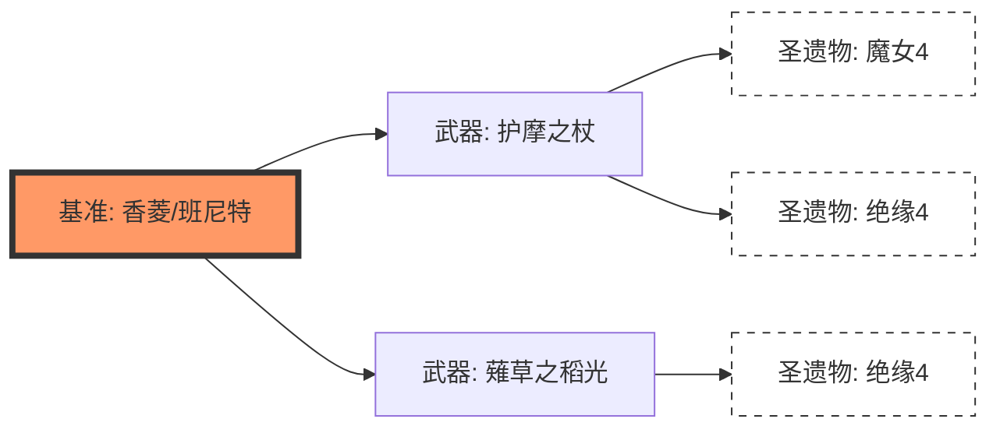

# UI 设计：批量处理之“分支宇宙”树形画布

## 1. 设计核心 (Concept)
取消传统的线性列表配置，引入 **“无限画布 (Infinite Canvas) + 树形派生 (Tree Derivation)”** 模式。用户通过直观的图形化树状结构，构建不同路径下的战斗样本。

## 2. 节点逻辑 (Node Definition)

### 2.1 根节点 (Root Node) - 基准宇宙
*   **标识**: `[BASE]`
*   **内容**: 当前仿真工作台中配置的完整队伍状态。
*   **特性**: 它是所有分支的逻辑起点，且全场唯一。

### 2.2 变异节点 (Mutation Node) - 局部修改
*   **职责**: 对父节点的配置进行 **单一属性或对象** 的修改。
*   **规则**:
    *   `[Set: 武器=护摩]` (对象替换)
    *   `[Add: 攻击力+10%]` (标量叠加)
    *   `[Repeat: N=50]` (蒙特卡洛随机采样)
*   **继承**: 子节点自动继承从根节点到其当前路径上的 **所有** 修改规则。

### 2.3 叶子节点 (Leaf Node) - 仿真样本
*   **职责**: 代表一个具体的、可运行的 `Simulator` 实例。
*   **计算**: 叶子节点数量 = 仿真任务总数。

---

## 3. 画布交互规范 (Interaction)

### 3.1 派生与生长 (Growth)
*   点击节点右侧的 **“+”** 图标：
    1.  从当前节点拉出一条连接线。
    2.  弹出 **属性拾取器**。
    3.  选择修改目标并输入值。
    4.  生成一个新的子节点。

### 3.2 节点检视 (Inspector)
*   **选中节点**: 右侧 Inspector 显示该节点的具体修改内容。
*   **悬停连线**: 显示路径上的累积变更摘要。

### 3.3 批量执行 (Collapse)
*   画布右上角实时显示统计：`派生宇宙: 12 | 预计时间: 15s`。
*   点击 **“开始仿真”**：系统将执行树的深度优先遍历（DFS），生成 12 份完整的配置 Bundle 并分发给进程池。

---

## 4. 后端适配要求

1.  **路径追踪 (Path Tracking)**: `ConfigGenerator` 必须支持接收 `List[ModifierRule]` 序列，并按顺序递归应用修改。
2.  **树序列化**: UI 需要将画布上的树形结构序列化为 JSON 格式的任务描述符。

---

## 5. 视觉参考 (Draft)

---
*版本: V1.0 (Canvas Paradigm)*
*日期: 2026-02-09*
