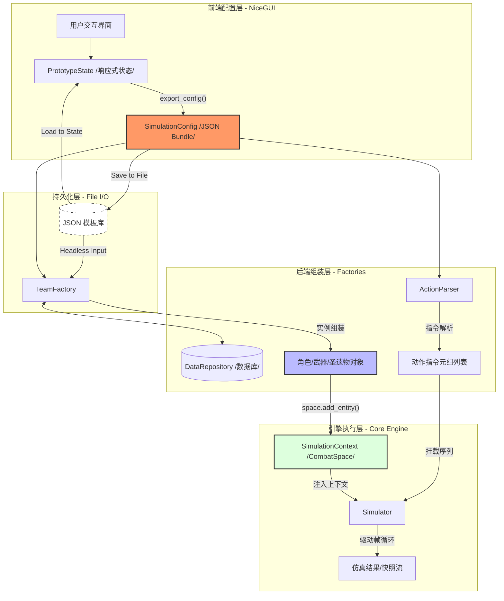

# 数据传输架构 (Data Transmission Architecture)

## 1. 架构目标
打通“前端 UI 配置”与“后端仿真引擎”之间的数据断层，确保全生命周期（配置-编排-仿真）的数据一致性与可追溯性。

## 2. 数据流向 (Data Flow)
1.  **配置阶段 (UI)**: 用户在 NiceGUI 界面通过 `PrototypeState` 录入原始参数。
2.  **持久化阶段 (File I/O)**: 
    *   **保存**: 将 `PrototypeState` 序列化为 `.json` 模板文件。
    *   **加载**: 从 `.json` 文件恢复状态至 `PrototypeState`，或直接跳过 UI 供后端调用。
3.  **导出阶段 (Serializing)**: UI 或加载器产出标准 JSON 契约。
4.  **组装阶段 (Assembling)**: `TeamFactory` 与 `ActionParser` 接收数据，查询数据库并实例化。
5.  **注入与驱动**: 实体注入 Context 并由 `Simulator` 运行。

### 2.1 架构流程图 (Visual Flow)

## 3. 文件 I/O 与持久化 (Persistence)

### 3.1 模板保存 (Save)
*   **触发时机**: 用户点击 UI 顶栏的 `[保存配置]`。
*   **处理逻辑**: 将当前 `PrototypeState` 完整转换为 JSON 字符串，写入 `data/templates/` 目录。
*   **元数据**: 包含创建时间、版本号、描述信息。

### 3.2 模板加载 (Load)
*   **UI 模式**: 用户选择历史文件，系统递归更新 `PrototypeState` 字段，触发 UI 局部刷新。
*   **无头模式 (Headless)**: `Simulator` 直接读取文件内容绕过 GUI。

### 3.3 数据库同步 (DB Sync)
*   加载旧模板时，需通过 `DataRepository` 重新校验 ID 有效性，防止因版本更新导致的数据库 ID 漂移。

## 3. 核心数据契约 (The Config Bundle)

仿真输入是一个名为 `SimulationConfig` 的标准 JSON 对象，包含以下两个根节点：

### 3.1 `context_config` (环境配置)
描述仿真的静态初始状态。
*   **`team`**: 角色列表。
    *   结构：`{ "character": {...}, "weapon": {...}, "artifacts": [...] }`
    *   **ID/Name 对齐**: `character` 对象必须包含 `id` (int)，后端通过 `id` 索引数据库属性。
    *   **圣遗物转换**: UI 的槽位字典需展平为 `TeamFactory` 预期的 `List[Dict]`。
*   **`targets`**: 目标列表。包含等级、抗性以及初始坐标。
*   **`environment`**: 包含全局 Buff、天气、地理位置。

### 3.2 `sequence_config` (动作序列)
描述仿真过程中的动态指令。
*   结构：`List[Dict]`
*   字段：
    *   **`character_name`**: 执行者名称。
    *   **`action_key`**: 意图动作（对应 `ACTION_NAME_MAP`，如 "skill", "burst"）。
    *   **`params`**: 意图字典。包含用户在 UI 选择的非物理逻辑参数（如点按/长按、段落选择、备注）。
    *   **`timestamp`**: (可选) 动作发生的时间戳。

## 4. 数据契约演进 (The Command Flow)

为了消除 Parser 与 Skill 之间的断层，系统采用“无损意图传输”架构：

1.  **UI 意图捕获**: UI 不再尝试计算位移或解析物理帧，而是产出包含原始 `params` 的 JSON 配置。
2.  **ActionParser 验证**: 解析器负责验证 JSON 结构并将数据转换为 `ActionCommand` 对象，**禁止**在此层对 `params` 进行业务降维或丢弃。
3.  **Simulator 调度**: 模拟器将 `ActionCommand` 发送给目标角色的 `ActionManager`。
4.  **Skill 意图解析**: 角色根据 `ActionCommand.action_key` 找到对应技能，调用 `skill.to_action_data(intent)`。技能根据意图字典，检索并产出绑定的 `ActionFrameData`（包含固有的物理位移与时序），最终注入状态机。

### 4.1 关键重构任务 (Refactor Roadmap)

*   **TeamFactory 升级**:
    *   **解耦映射**: 支持通过 `name` 自动补全 `id` 或直接通过 UI 传入的 `id` 进行装配。
    *   **结构适配**: 调整 `_build_character` 方法，递归解析嵌套的 `weapon` 和 `artifacts` 对象。
    *   **容错处理**: 增加对缺失资源（如未实现的类）的优雅回退。

*   **空间注入逻辑**:
    *   **物理落位**: `CombatSpace` 必须接收 `(X, Z, Rotation)` 参数。
    *   **实体注册**: 实体实例在创建后，需立即调用 `ctx.space.add_entity()` 注册到对应的 Faction 列表中。

*   **UI 导出转换器 (UI-to-Sim Converter)**:
    *   在 `PrototypeState` 中实现 `export_for_simulation()` 方法。
    *   **主要职责**:
        *   将 `talents` 列表 `[10, 10, 10]` 拼接为 `"10/10/10"`。
        *   将圣遗物 Slot 字典展平。
        *   确保所有数值类型（如等级、精炼）均为后端要求的 `int` 类型。

## 5. 异常处理协议
*   **校验失败**: 若 UI 录入的角色 ID 在 `CharacterClassMap` 中无对应类，阻止仿真启动并返回错误。
*   **版本不一致**: 若 JSON 结构与 Factory 版本不匹配，提示“配置模板已过期”。

---
*状态: V1.1 (ActionCommand Protocol)*
*日期: 2026-02-09*
